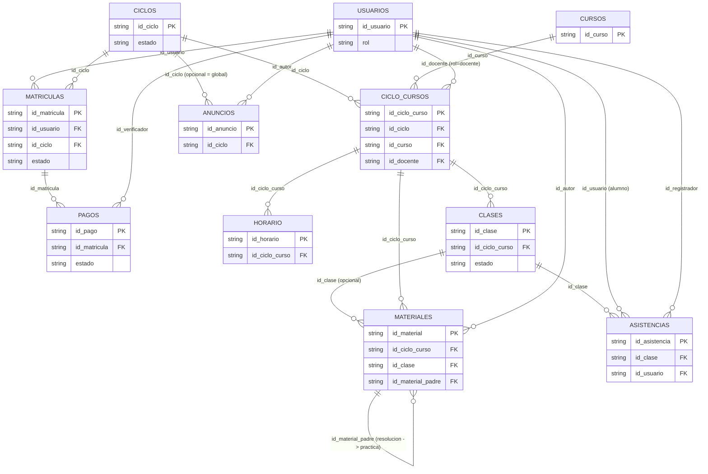

# Modelo de Datos — BD Guyton

Un solo spreadsheet ("BD Guyton") con 12 hojas de datos + 1 hoja `LEEME`. Este documento
describe cada hoja columna por columna, las reglas de integridad, la convención de Drive y qué
se agregará después sin romper lo existente.

## Convenciones generales

- **Ids**: prefijo por tabla + número correlativo de 3 dígitos, ej. `usr-001`, `cic-001`. En los
  datos DEMO del Excel, el número se reemplaza por `demo-N` (ej. `usr-demo-1`) para que sea
  imposible confundirlos con datos reales.
- **Headers**: `snake_case`, exactos. No renombrar ni traducir — el backend de Apps Script
  (Fase 2) los referenciará literalmente.
- **Fechas**: `YYYY-MM-DD`. **Horas**: `HH:MM` (24h).
- **Estados**: siempre en minúsculas, sin tildes, valores cerrados a la lista indicada en cada
  hoja (no son texto libre).
- **Relaciones**: siempre por id. Nunca se repite un nombre, dni, o dato descriptivo de una
  tabla dentro de otra — si hace falta, se navega por el id hasta la tabla dueña del dato.
- **Prefijos por tabla** (para que no haya colisión entre ids que empiezan igual):

| Hoja | Prefijo | Ejemplo |
|---|---|---|
| usuarios | `usr` | usr-001 |
| ciclos | `cic` | cic-001 |
| cursos | `cur` | cur-001 |
| ciclo_cursos | `cco` | cco-001 |
| matriculas | `mat` | mat-001 |
| pagos | `pag` | pag-001 |
| horario | `hor` | hor-001 |
| clases | `cls` | cls-001 |
| materiales | `mtl` | mtl-001 |
| asistencias | `asi` | asi-001 |
| anuncios | `anu` | anu-001 |

`matriculas` (`mat`) y `materiales` (`mtl`) usan prefijos distintos a propósito, aunque ambas
palabras empiecen igual — es la clase de colisión silenciosa que rompería un `VLOOKUP` sin dar
error.

---

## 1. `config`

Pares clave-valor de configuración global. No es una tabla relacional; el backend la lee entera
al iniciar.

| Columna | Tipo | Obligatoria | Descripción | Ejemplo |
|---|---|---|---|---|
| clave | texto | sí | Nombre único de la variable de configuración | `whatsapp` |
| valor | texto | sí (puede llegar vacío mientras no se defina) | Valor actual | `+51 986 833 308` |
| descripcion | texto | sí | Para qué se usa, en español simple | `Número de WhatsApp de contacto de la academia` |

Filas semilla (fijas, no se agregan ni quitan sin razón): `nombre_academia`, `whatsapp`,
`drive_root_id` (vacío hasta que el usuario comparta la carpeta Drive — ver Fase 1 del plan
maestro), `color_primario`, `color_acento`, `lema`.

---

## 2. `usuarios`

Padrón único de **todas** las personas del sistema — un estudiante, un docente, un auxiliar y
el superadmin son filas de la misma hoja, diferenciadas solo por `rol`.

| Columna | Tipo | Obligatoria | Descripción | Ejemplo |
|---|---|---|---|---|
| id_usuario | texto (id) | sí | Identificador único | `usr-demo-4` |
| dni | texto | sí | DNI, también sirve de usuario de login | `70000004` |
| nombres | texto | sí | Nombres | `Luis` |
| apellidos | texto | sí | Apellidos | `Condori Yucra` |
| celular | texto | no | Celular de contacto | `986111004` |
| email | texto | no | Correo | `luis.estudiante@guyton.demo` |
| rol | texto (enum) | sí | `superadmin` / `docente` / `auxiliar` / `estudiante` | `estudiante` |
| clave_acceso | texto | sí | PIN simple para el MVP; el `.gs` de la Fase 2 la valida | `4444` |
| foto_url | texto | no | Enlace a foto en Drive | (vacío hasta tener fotos autorizadas) |
| estado | texto (enum) | sí | `activo` / `inactivo` — habilitación de la **cuenta**, no de su matrícula | `activo` |
| fecha_registro | fecha | sí | Alta en el sistema | `2026-06-20` |

**Nota de diseño:** `estado` aquí es independiente del estado de la matrícula (hoja
`matriculas`). Un alumno puede tener la cuenta `activa` y estar `retirado` de un ciclo — son
dos preguntas distintas ("¿puede entrar al sistema?" vs. "¿está inscrito ahora?").

**Nota de rol único:** si una persona cumple dos funciones en la práctica, se le asigna el rol
de mayor privilegio en esta única fila; no se crean dos usuarios para la misma persona.

---

## 3. `ciclos`

Cada ciclo de preparación (ej. un semestre). Diseñada para sostener **N ciclos simultáneos**
(uno `en_curso` y otro `planificado` al mismo tiempo, por ejemplo).

| Columna | Tipo | Obligatoria | Descripción | Ejemplo |
|---|---|---|---|---|
| id_ciclo | texto (id) | sí | Identificador único | `cic-demo-1` |
| nombre | texto | sí | Nombre visible del ciclo | `2026-II` |
| anio | número | sí | Año del ciclo | `2026` |
| fecha_inicio | fecha | sí | Inicio de clases | `2026-07-06` |
| fecha_fin | fecha | sí | Fin de clases | `2026-12-19` |
| estado | texto (enum) | sí | `planificado` / `inscripciones_abiertas` / `en_curso` / `finalizado` | `en_curso` |
| precio_matricula | número | sí | Monto de matrícula en soles | `100.00` |
| precio_mensualidad | número | sí | Monto de cada mensualidad | `250.00` |
| n_mensualidades | número | sí | Cuántas mensualidades tiene el ciclo | `5` |
| descripcion | texto | no | Notas libres | `Ciclo semestral 2026-II` |

---

## 4. `cursos`

Catálogo **global** de cursos, independiente del ciclo (Matemática existe como concepto se dicte
o no en un ciclo dado).

| Columna | Tipo | Obligatoria | Descripción | Ejemplo |
|---|---|---|---|---|
| id_curso | texto (id) | sí | Identificador único | `cur-demo-1` |
| nombre | texto | sí | Nombre del curso | `Matemática` |
| descripcion | texto | no | Descripción breve | `Álgebra, aritmética y geometría para el examen de admisión` |
| orden | número | sí | Orden de presentación en listados | `1` |

---

## 5. `ciclo_cursos` — la tabla puente (el corazón de la escalabilidad)

Qué curso se dicta en qué ciclo y quién lo dicta. Es la relación N:M entre `ciclos` y `cursos`,
y el único lugar donde vive la asignación de docente por ciclo.

| Columna | Tipo | Obligatoria | Descripción | Ejemplo |
|---|---|---|---|---|
| id_ciclo_curso | texto (id) | sí | Identificador único | `cco-demo-1` |
| id_ciclo | texto (FK → ciclos) | sí | Ciclo en el que se dicta | `cic-demo-1` |
| id_curso | texto (FK → cursos) | sí | Curso del catálogo | `cur-demo-1` |
| id_docente | texto (FK → usuarios, rol=docente) | no (puede quedar vacío mientras no se asigna) | Docente a cargo | `usr-demo-2` |
| orden | número | sí | Orden dentro del ciclo | `1` |

Todo lo que "pertenece" a un curso dictado en un ciclo (horario, clases, materiales) cuelga de
`id_ciclo_curso`, nunca directamente de `id_ciclo` + `id_curso` por separado — así no hay que
repetir el par en cada hoja hija.

---

## 6. `matriculas`

La inscripción de un usuario a un ciclo.

| Columna | Tipo | Obligatoria | Descripción | Ejemplo |
|---|---|---|---|---|
| id_matricula | texto (id) | sí | Identificador único | `mat-demo-1` |
| id_usuario | texto (FK → usuarios) | sí | Quién se matricula | `usr-demo-4` |
| id_ciclo | texto (FK → ciclos) | sí | En qué ciclo | `cic-demo-1` |
| fecha | fecha | sí | Fecha de la matrícula | `2026-06-28` |
| estado | texto (enum) | sí | `preinscrito` / `matriculado` / `retirado` | `matriculado` |
| turno | texto | no | Turno del alumno | `tarde` |
| observaciones | texto | no | Notas libres | `Matrícula completa` |

---

## 7. `pagos`

Cada pago reportado, ligado a la matrícula (que ya sabe alumno + ciclo, así que no se repiten).

| Columna | Tipo | Obligatoria | Descripción | Ejemplo |
|---|---|---|---|---|
| id_pago | texto (id) | sí | Identificador único | `pag-demo-1` |
| id_matricula | texto (FK → matriculas) | sí | Matrícula a la que corresponde | `mat-demo-1` |
| concepto | texto (enum) | sí | `matricula` / `mensualidad_1` … `mensualidad_N` | `matricula` |
| monto | número | sí | Monto reportado | `100.00` |
| fecha_reporte | fecha | sí | Cuándo el alumno reportó el pago | `2026-06-28` |
| fecha_verificacion | fecha | no | Cuándo se verificó (vacío si sigue pendiente) | `2026-06-29` |
| medio | texto (enum) | sí | `yape` / `plin` / `efectivo` / `transferencia` | `yape` |
| estado | texto (enum) | sí | `pendiente` / `verificado` / `rechazado` | `verificado` |
| voucher_ref | texto | no | Referencia del comprobante | `YAPE-000123` |
| id_verificador | texto (FK → usuarios) | no (vacío hasta que se verifique) | Quién verificó | `usr-demo-3` |

---

## 8. `horario` — plantilla semanal recurrente

El patrón de la semana ("los lunes de 18:00 a 20:00"), no una fecha concreta.

| Columna | Tipo | Obligatoria | Descripción | Ejemplo |
|---|---|---|---|---|
| id_horario | texto (id) | sí | Identificador único | `hor-demo-1` |
| id_ciclo_curso | texto (FK → ciclo_cursos) | sí | Curso dictado al que pertenece este bloque | `cco-demo-1` |
| dia_semana | texto (enum) | sí | `lunes`…`sabado` | `lunes` |
| hora_inicio | hora | sí | Inicio del bloque | `18:00` |
| hora_fin | hora | sí | Fin del bloque | `20:00` |
| aula_o_enlace | texto | no | Aula física o enlace recurrente | `Meet: meet.google.com/guyton-mat` |

---

## 9. `clases` — sesiones fechadas reales

No es redundante con `horario`: `horario` es el patrón, `clases` son las instancias concretas
(pasadas o programadas) que de verdad ocurren, cada una con su propio estado. Aquí es donde se
cuelgan grabación y asistencia — por eso necesitan fecha propia y no basta con el patrón
semanal.

| Columna | Tipo | Obligatoria | Descripción | Ejemplo |
|---|---|---|---|---|
| id_clase | texto (id) | sí | Identificador único | `cls-demo-1` |
| id_ciclo_curso | texto (FK → ciclo_cursos) | sí | Curso dictado al que pertenece | `cco-demo-1` |
| fecha | fecha | sí | Fecha de la sesión | `2026-07-13` |
| hora_inicio | hora | sí | Inicio real | `18:00` |
| hora_fin | hora | sí | Fin real | `20:00` |
| tema | texto | sí | Tema tratado en esa sesión | `Números reales y operaciones básicas` |
| modalidad | texto (enum) | sí | `presencial` / `virtual` | `virtual` |
| enlace_en_vivo | texto | no | Enlace de la sesión virtual (vacío si es presencial) | `https://meet.google.com/guyton-mat` |
| estado | texto (enum) | sí | `programada` / `dictada` / `cancelada` | `dictada` |

Una `clase` puede apartarse puntualmente del patrón de `horario` (ej. una sesión presencial de
repaso aunque el curso sea normalmente virtual) — eso es exactamente lo que separa "patrón" de
"instancia real".

---

## 10. `materiales`

| Columna | Tipo | Obligatoria | Descripción | Ejemplo |
|---|---|---|---|---|
| id_material | texto (id) | sí | Identificador único | `mtl-demo-1` |
| id_ciclo_curso | texto (FK → ciclo_cursos) | sí | Curso dictado al que pertenece | `cco-demo-1` |
| id_clase | texto (FK → clases) | no | Sesión a la que corresponde, si aplica | `cls-demo-1` |
| tipo | texto (enum) | sí | `video_grabado` / `pdf_teoria` / `pdf_practica` / `pdf_resolucion` / `enlace` | `pdf_practica` |
| titulo | texto | sí | Título visible | `Práctica 1: Números reales` |
| semana | número | no | Semana del ciclo | `1` |
| url_drive | texto | sí (para publicarse) | Enlace de Drive o enlace externo — misma columna para ambos casos | `https://drive.google.com/...` |
| id_material_padre | texto (FK → materiales) | no | Si es una resolución, apunta a la práctica que resuelve | `mtl-demo-1` |
| fecha_publicacion | fecha | sí | Fecha en que se publicó (o se publicará) | `2026-07-13` |
| id_autor | texto (FK → usuarios) | sí | Quién lo subió | `usr-demo-2` |
| estado | texto (enum) | sí | `borrador` / `publicado` | `publicado` |

**Patrón "fila pública":** subir el archivo a Drive y pegar su enlace en `url_drive` no lo hace
visible por sí solo — solo cuando `estado = publicado` la plataforma lo muestra. Un archivo en
Drive sin fila (o con fila en `borrador`) no aparece para los alumnos.

**Clave de diseño (`id_material_padre`):** una fila `pdf_resolucion` no repite curso, semana ni
título — solo apunta a la fila `pdf_practica` que resuelve, y la plataforma las muestra juntas.

---

## 11. `asistencias`

Rol principal: auxiliar (pasa lista), aunque el docente también puede.

| Columna | Tipo | Obligatoria | Descripción | Ejemplo |
|---|---|---|---|---|
| id_asistencia | texto (id) | sí | Identificador único | `asi-demo-1` |
| id_clase | texto (FK → clases) | sí | Sesión en la que se registra | `cls-demo-1` |
| id_usuario | texto (FK → usuarios, rol=estudiante) | sí | Alumno registrado | `usr-demo-4` |
| estado | texto (enum) | sí | `presente` / `tardanza` / `falta` / `justificado` | `presente` |
| id_registrador | texto (FK → usuarios) | sí | Quién pasó lista | `usr-demo-3` |
| observacion | texto | no | Notas libres | (vacío) |

---

## 12. `anuncios`

| Columna | Tipo | Obligatoria | Descripción | Ejemplo |
|---|---|---|---|---|
| id_anuncio | texto (id) | sí | Identificador único | `anu-demo-1` |
| id_ciclo | texto (FK → ciclos) | no | Vacío = anuncio global (todos los ciclos) | `cic-demo-1` |
| titulo | texto | sí | Título | `Recordatorio: pago de mensualidad` |
| cuerpo | texto | sí | Contenido | `Recuerda reportar tu pago antes del 25.` |
| fecha | fecha | sí | Fecha de publicación | `2026-07-17` |
| fijado | texto (enum) | sí | `si` / `no` — si se ancla arriba del listado | `no` |
| id_autor | texto (FK → usuarios) | sí | Quién lo publicó | `usr-demo-3` |
| estado | texto (enum) | sí | `publicado` / `oculto` | `publicado` |

---

## Diagrama de relaciones



---

## Reglas de integridad y no-redundancia

1. Todo FK debe existir en la hoja referida antes de guardarse (el Apps Script de la Fase 2 lo
   valida en el servidor; en el Excel/Sheet manual, quien edite a mano debe respetarlo).
2. Ningún dato descriptivo de una entidad (nombre de persona, nombre de curso, monto de un
   pago ya guardado en otra fila, etc.) se copia en otra hoja — se navega por id.
3. Un `id_usuario` tiene un único `rol` activo a la vez.
4. `pagos.id_matricula` es obligatorio; nunca se guarda un pago con dni/ciclo sueltos.
5. `materiales.id_material_padre`, si existe, debe apuntar a una fila cuyo `id_ciclo_curso` sea
   el mismo (una resolución no puede apuntar a una práctica de otro curso).
6. Un archivo subido a Drive sin fila correspondiente en `materiales`, o con `estado: borrador`,
   no se expone en la plataforma (patrón "fila pública").
7. Los ids nunca se reutilizan aunque una fila se borre lógicamente (se prefiere marcar
   `estado: inactivo`/`retirado`/`cancelada` antes que borrar filas).

## Convención de Google Drive

```
<carpeta raíz (config.drive_root_id)>
└── <Ciclo>/                  ej. "2026-II"
    └── <Curso>/              ej. "Matemática"
        ├── Grabaciones/
        ├── Teoria/
        ├── Practicas/
        └── Resoluciones/
```

Subir el archivo a la subcarpeta correcta es necesario pero no suficiente: hace falta además
pegar su enlace en la fila correspondiente de `materiales` con `estado: publicado` para que
aparezca en la plataforma (ver regla de integridad 6).

## Qué se agregará después sin romper este modelo

Solo se listan por nombre — su diseño detallado es trabajo de una fase futura, no de hoy:

- **notas** — calificaciones de exámenes/prácticas por alumno.
- **ranking** — posiciones comparativas entre alumnos de un ciclo.
- **simulacros** — exámenes de simulacro tipo admisión, con sus resultados.

Todas estas se podrán añadir como hojas nuevas que cuelguen de `id_usuario`, `id_ciclo_curso` o
`id_matricula` sin modificar ninguna de las 12 hojas actuales.

---

## Observaciones del ejecutor

Notas del subagente que implementó este documento — no cambian la especificación, solo señalan
puntos a considerar cuando el usuario confirme el modelo antes de la Fase 1:

- **`config` como pares clave-valor** funciona bien para el MVP, pero Apps Script tendrá que
  leer la hoja completa y armar un objeto en memoria en cada ejecución (no hay problema de
  performance a esta escala, solo notarlo para quien escriba el `.gs`).
- **`matriculas.turno`** es texto libre en la especificación; si la academia solo maneja un
  número fijo de turnos (mañana/tarde/noche), convertirlo a enum evitaría variantes como
  "Tarde" vs "tarde" escritas a mano en Sheets.
- **`pagos.concepto`** con valores `mensualidad_1`...`mensualidad_N` es flexible, pero como es
  texto libre no hay nada que impida escribir `mensualidad_6` en un ciclo con
  `n_mensualidades = 5`. Una validación de datos en Sheets (o en el `.gs`) contra
  `ciclos.n_mensualidades` evitaría el desfase.
- **Prefijos `mat` (matrículas) y `mtl` (materiales)**: se eligieron para evitar la colisión que
  tendrían si ambas usaran `mat`, ya que la especificación original solo daba `usr` y `cic`
  como ejemplo. Si el usuario prefiere otros prefijos, es un cambio de bajo riesgo porque no
  afecta la estructura, solo el texto de los ids.
